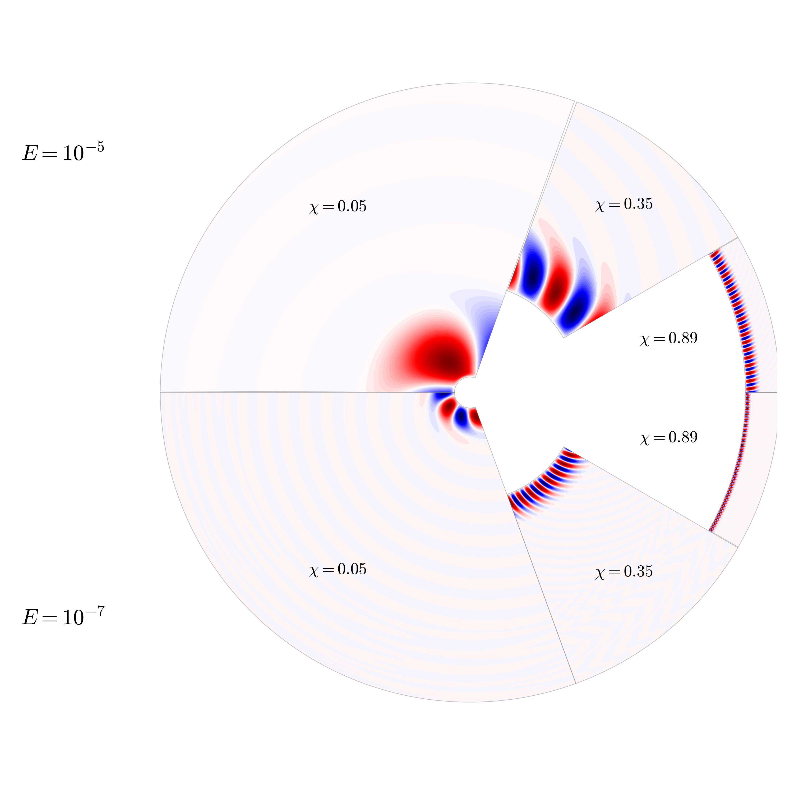

Convection in rotating spherical shells is ubiquitous in planets and stars. Before fully understanding the nonlinear process, we must make efforts in understanding the linear part - the onset of convection. Though this has been an active area of research since the times of Chandrasekhar, very little work had been done in understanding how the critical parameters of convection vary with the aspect ratio of a spherical shell $\chi=r_i/r_o$ . We used the eigenvalue code [Kore](/project/kore) to compute the critical onset of convection across four decades in rotation rate (Ekman number) and for $0.05\leq\chi\leq 0.95$, spanning almost all possible cases in astrophysical objects. The database has been made openly available and is being used by other publications to understand where in the physical regime their simulations are. For more information, you can read the (open access) publication.
{style="text-align: justify;"}