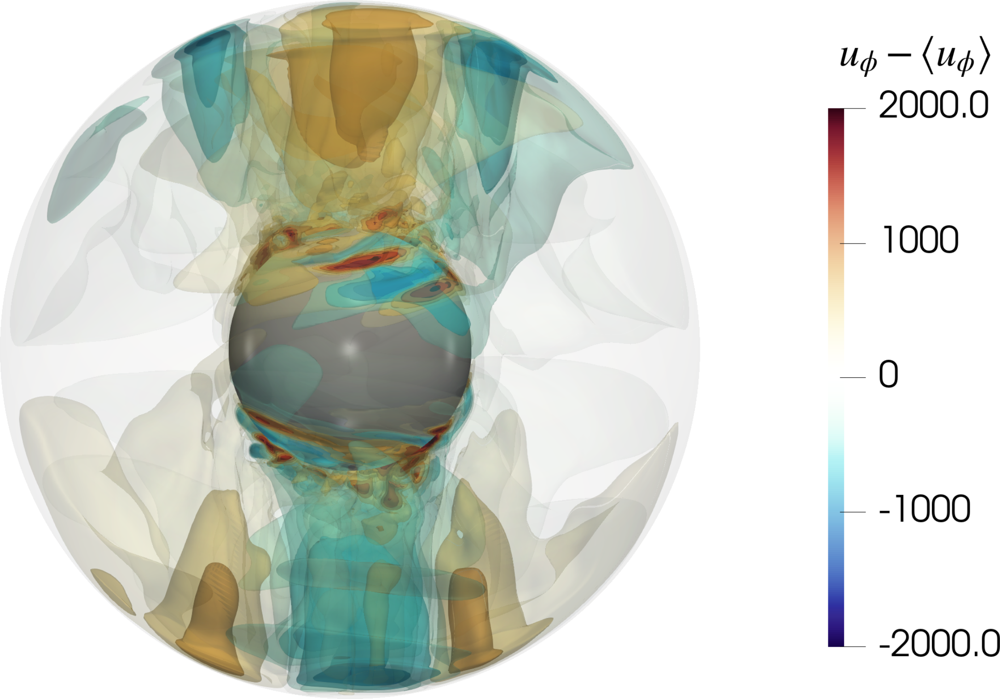

The spherical Couette system is the spherical analogue of the classic Taylor-Couette setup, with two concentric coaxial differentially rotating spherical spheres. The space between the spheres is filled with a fluid which is viscously driven. This is the setup used by the new generation of dynamo experiments such as the three meter experiment in College Park, Maryland and the DTS Experiment in Grenoble, France. This provides a more accurate geometry akin to planetary and stellar interiors and provides a relatively simpler system to study various fluid instabilities and turbulence in spherical shells.
{style="text-align: justify;"}

I studied this system during my PhD (see thesis [here]( http://dx.doi.org/10.53846/goediss-6562)). My simulations successfully reproduced experimental observations in the experiments at Cottbus by [Hoff et al., 2016](https://doi.org/10.1103/PhysRevFluids.1.043701). There are a number of interesting questions that we attempted to answer in our work. First was the onset of **global inertial modes** by differential rotation itself. Second is the **transition to turbulence** at a critical differential rotation. Our [first publication in JFM](/publication/barik-et-al-2018/) addresses the first question while the second is under review which addresses the second question.
{style="text-align: justify;"}