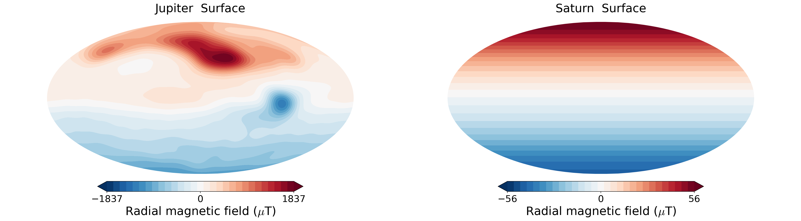

The gas giants - Jupiter and Saturn - have a similar size and are composed mostly of Hydrogen and Helium. However, their magnetic fields are completely different. Jupiter has the strongest magnetic field among all the planets while Saturn's field is comparable to that of Earth. The Juno and Cassini missions gave us a wealth of information about the the gas giants.

Both missions with contraints from gravity and magnetic data have revealed a few key features of the two planets:

  - A dilute "fuzzy" core at the interior
  - Presence of stably stratified layers
  - Zonal winds that penetrate to different depths on the two planets

Explaining all of these features at the same time requires three dimensional simulations of the dynamo being generated inside the planets, with realistic profiles of interior properties. A key features of the simulations are including stably stratified layers in different forms to account for,  explain and constrain the above three features.
