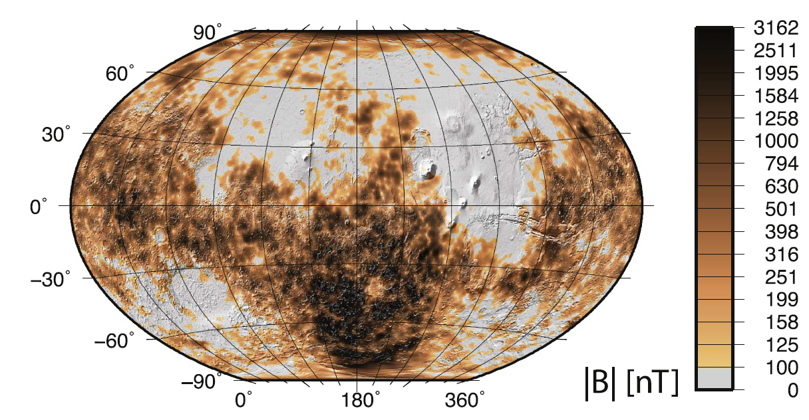
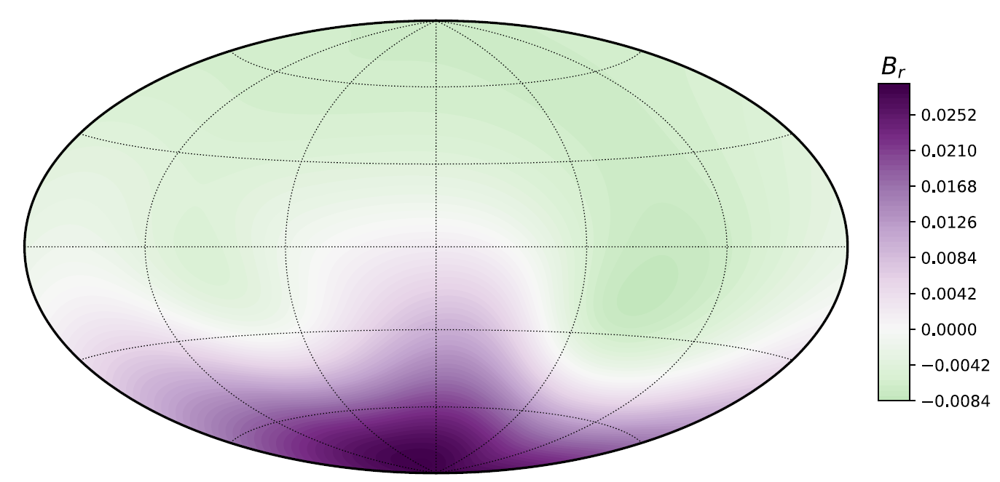

Mars does not currently generate its own magnetic field. However, the crust of Mars has recorded its ancient magnetic field and it is quite unusual. It has a much higher magnetitude in the souther hemisphere compared to the northern.

We simulate the dynamo of Mars with a heat flux variation at the core-mantle boundary (CMB) such that there is greater heat flux coming out of the southern hemisphere. This enhances convection in one hemisphere compared to another and yields "hemispherical" dynamos - with one hemisphere having higher magnetic field than another.

