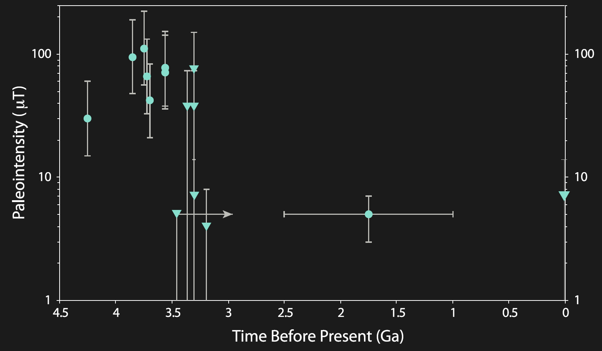
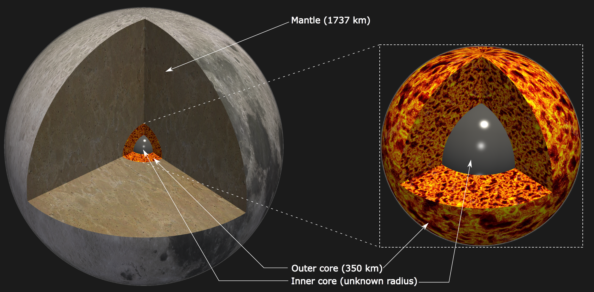

Paleomagnetic analysis of rock samples returned from the Apollo missions have revealed that the Moon used to have a very strong magnetic field, higher than that of present day Earth 100$\mu$T, which then later dropped to values of around 10$\mu$T and eventually, at present day the moon does not generate any magnetic field.

The problem with generating such a strong magnetic field on the moon is the size of its core. A core of this size cannot have the amount of power needed to generate a magnetic field of this magnitude *at the surface*, keeping in mind that the core is very far away from the surface.

In addition, any dynamo mechanism attempting to explain the lunar paleomagnetic record must explain the following three things:

  - High magnetic field in the ancient past
  - Low magnetic field thereafter
  - No magnetic field in present day

A few different dynamo mechanisms have been proposed, each with their pros and cons:

  - Thermochemical convection:
    - Field intensity : low :x:
    - Lifetime : long :white_check_mark:
  - Basal magma ocean:
    - Field intensity : high :white_check_mark:
    - Lifetime: limited :white_check_mark:
    - Requires high magma conductivity :question:
  - Mechanical driving (e.g.: precession):
    - Field intensity : high :white_check_mark:
    - Lifetime: limited :white_check_mark:
    - Very hard to run simulations and scale to real values :x:

We followed a slightly different approach and found that a mix of convection and precession has the potential to explain all three features of the lunar paleomagnetic record.