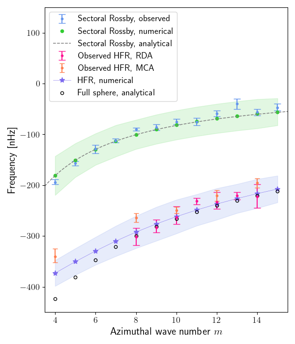

The recent observations of Rossby waves by [Löptien et al., 2018](https://doi.org/10.1038/s41550-018-0460-x) caused quite a stir in the solar physics community and a renewed interest in inertial waves. Subsequent observations of High Frequency Retrograde (HFR) vorticity waves by [Hanson et al., 2022](https://doi.org/10.1038/s41550-022-01632-z) raised a question of whether they are related to any theoretical known waves. We used the linear MHD code [Kore](/project/kore) to compute inertial eigenmodes of spherical shells and found that the aspect ratio of the solar convective shell r_i/r_o = 0.71, both sets of eigenmodes matched rather well with the observations. What is surprising is that our model did not have any density stratification, unlike the Sun.
{style="text-align: justify;"}