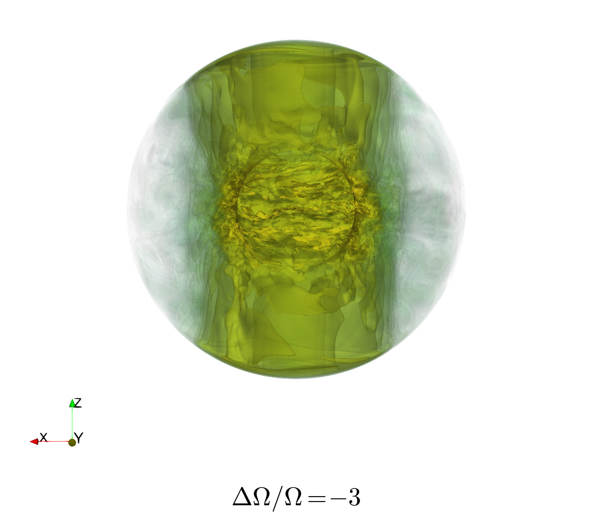
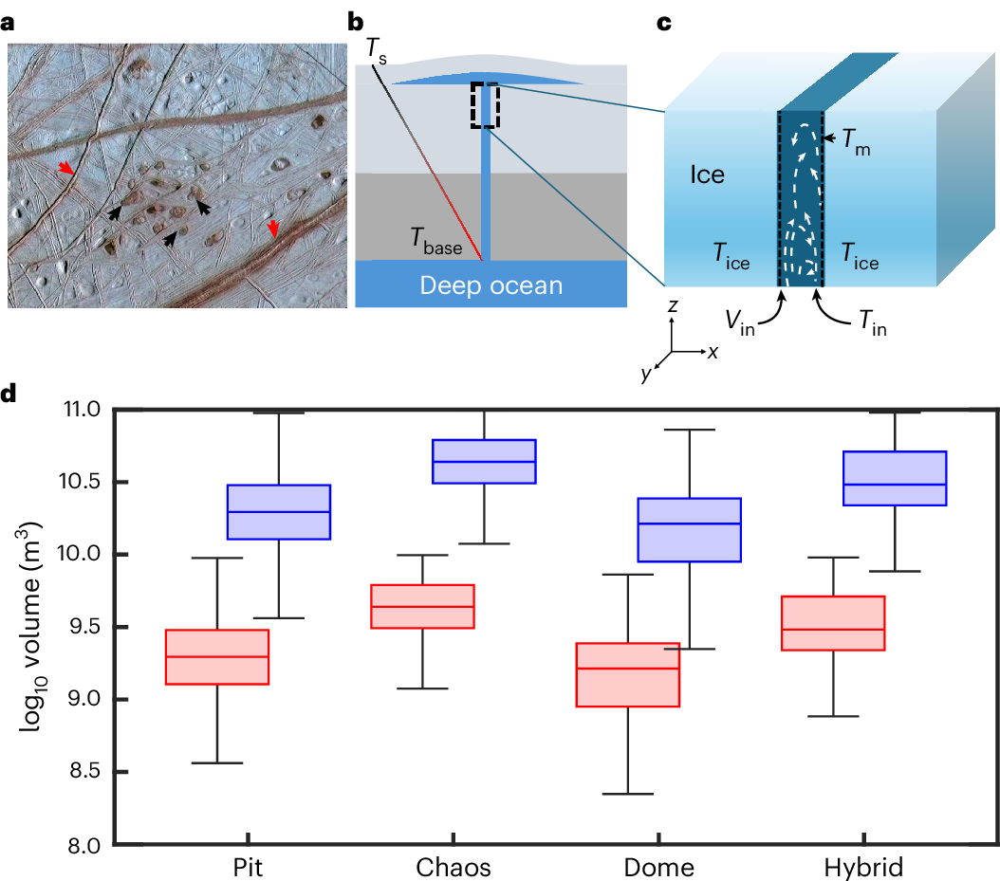

How does smooth, ordered flow break down into turbulence? In a laboratory spherical Couette experiment, we traced a sudden transition to turbulence to a centrifugal instability of the inner sphere's boundary layer, which seeds small-scale structures that grow into turbulence dominated by inertial waves and drive efficient angular momentum transport.

On a very different scale, turbulence also governs whether Europa's deep ocean can reach its icy surface: simulations of turbulent water flow through cracks in the ice shell show that rapid cooling forms frazil ice that clogs the pathway within hours, limiting direct exchange between the ocean and the shallow subsurface.

**Related publications:**
- [Limited direct fluid exchange between the deep subsurface ocean and the shallow subsurface environment of Europa](/publication/ojha-2026/) - *Nature Astronomy* (2026)
- [Transition to Turbulence in the Wide-Gap Spherical Couette System](/publication/barik-2024-jfm/) - *Journal of Fluid Mechanics* (2024)
