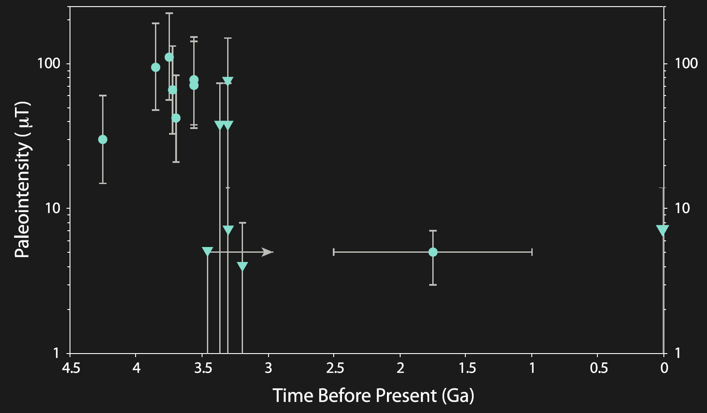
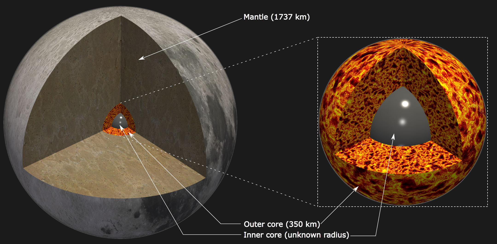
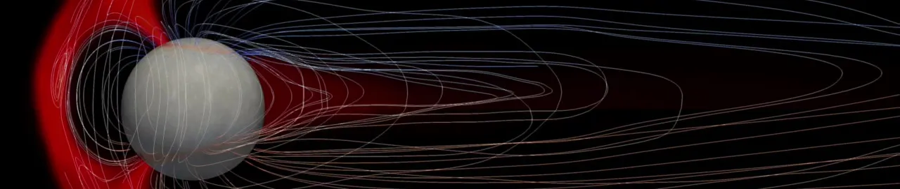
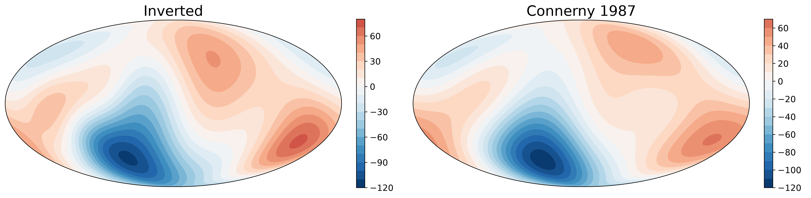

Not everything makes it into a journal. A few threads I've worked on are either still in progress, or were reported through a project report, a code repository, or a thesis rather than a paper.

## The Moon's dynamo

Paleomagnetic analysis of Apollo rock samples shows the Moon once had a magnetic field stronger than present-day Earth's, which then decayed to zero. No single proposed dynamo mechanism - thermochemical convection, a basal magma ocean, or mechanical driving by precession - explains the full history on its own.

We found that a mix of convection and precession has the potential to explain the strength, decline, and eventual disappearance of the lunar field together.

## External Fields (Mercury)

MESSENGER observations of Mercury's magnetotail provided details of the planet's field, but existing corrections for field-aligned currents (FACs) relied on empirical models.

Along with [Regupathi Angappan](https://reguang.wixsite.com/regupathiangappan), I adapted the MHD code [Kaiju](/research/software/#kaiju) (formerly GAMERA) to map the currents through Mercury's magnetosphere and solve for the FACs directly, aiming to better correct the MESSENGER data.

## Stellar angular momentum transport

Angular momentum transport from the core to the envelope of massive stars is a subject of active research. During the [Kavli Summer Program in Astrophysics 2021](https://kspa.soe.ucsc.edu/archives/2021), I supervised student Hachem Dhouib in studying this in a 3-solar-mass ZAMS star using the `MagIC` code. We found that internal gravity waves emanating from the radiative zone transport angular momentum through the star.

The video shows an equatorial section through the star with colors representing radial velocity: red (blue) is outward (inward).

<video src="movie_vrEqCut5e-4.mp4" controls=yes></video>

Read the full project report [here](https://kspa.soe.ucsc.edu/sites/default/files/Project%20report%20kavli%20%5BHachem%20Dhouib%5D.pdf).

## Uranus's magnetic field from Voyager 2

Uranus has been visited by a spacecraft exactly once: Voyager 2's 1986 flyby, which returned the only in-situ magnetic field measurements we have of the planet. I revisited that magnetometer data (from the Planetary Data System archives) to invert it for a spherical harmonic model of Uranus's internal field, using a regularized least-squares inversion with an L-curve criterion to pick the optimal regularization strength.

The recovered field agrees well with previously published models by Connerney et al. (1987), Holme & Bloxham (1996), and Herbert (2009). Code and figures are available at [github.com/AnkitBarik/voyager2icegiants](https://github.com/AnkitBarik/voyager2icegiants).
